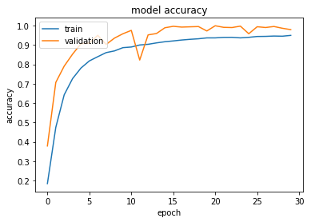
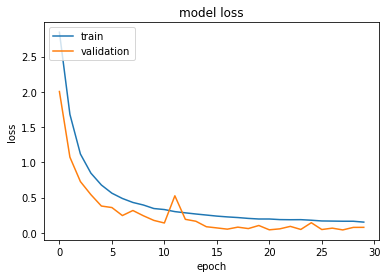
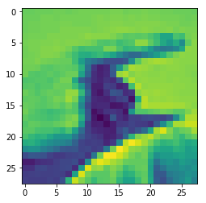

# Sign Language Reconition (MNIST Dataset) using Convolutional Neural Networks

## introduction

in this brief presentation we will show you how we created a small CNN, for sign language recognition from MNIST ASL dataset, this model has achievied an accuracy of 92.95% on new unseen data from the test test.

## let's import the required liberaries
in this machine learning demo we will use the Keras deeplearning framework, since it offers greate open source implementations for deeplearning concepts and it helps with prototyping and iterating over several DL models


```python
import numpy as np
import tensorflow as tf
import pandas as pd
from tensorflow.python.keras.layers import Input, Dropout, Conv2D, MaxPooling2D, BatchNormalization, Dense, Activation, Flatten
from tensorflow.python.keras.models import Model, model_from_json
from tensorflow.python.keras.utils import to_categorical


import matplotlib.pyplot as plt
import matplotlib.image as mpimg
```


```python
def load_data(dataset):
    
    #read the file and load it into a dataframe
    df= pd.read_csv(dataset)
    
    #getting the dimensions of the data
    size= df.shape[0]
    number_of_features = df.shape[1]
    
    #spliting the features and the labels
    x = np.array(df.iloc[:, 1:])
    y = np.array(df.iloc[:, 0])
    
    
    dataset_info = dict()
    dataset_info["size"] = size
    dataset_info["number_of_features"] = number_of_features
   
    return (x, y, dataset_info)
    
```


```python
def transform_data(x, y):
    
    size_set = x.shape[0]
    #create a placeholder for the new data 
    X_data = np.empty((size_set,28,28))
    
    #retrieve each line from the csv file and turn it into an image
    for i in range(size_set):
        X_data[i,:,:]=x[i,:].reshape(28,28)
    
    #reshaping the training data 
    X_data = X_data.reshape(size_set,28,28,1)
    
    #turn each element in y into a one hot vector
    Y_data = to_categorical(y)
    
    return (X_data, Y_data)
    
```


```python
def build_model(input_shape):
   
    # Define the input placeholder as a tensor with shape input_shape. Think of this as your input image!
    X_input = Input(input_shape)


    # CONV -> BN -> RELU Block applied to X
    X = Conv2D(10, (7, 7), strides = (1, 1), name = 'conv0', padding='same')(X_input)
    X = BatchNormalization(axis = 3, name = 'bn0')(X)
    X = Activation('relu')(X)
    X = MaxPooling2D((2, 2), strides=(2,2), name='max_pool0')(X)
    X = Dropout(0.4)(X)
    
    # CONV -> BN -> RELU Block applied to X
    X = Conv2D(7, (5, 5), strides = (1, 1), name = 'conv1', padding='valid')(X)
    X = BatchNormalization(axis = 3, name = 'bn1')(X)
    X = Activation('relu')(X)
    X = MaxPooling2D((2, 2), strides=(2,2), name='max_pool1')(X)
    X = Dropout(0.3)(X)
    
    # FLATTEN X  + FULLYCONNECTED
    X = Flatten()(X)
    X = Dense(25, activation='softmax', name='output')(X)

    # Create model. This creates your Keras model instance, you'll use this instance to train/test the model.
    model = Model(inputs = X_input, outputs = X, name='CNNclassifier')

    return model
```


```python
def plot_training_process(history):
    # summarize history for accuracy
    plt.plot(history.history['acc'])
    plt.plot(history.history['val_acc'])
    plt.title('model accuracy')
    plt.ylabel('accuracy')
    plt.xlabel('epoch')
    plt.legend(['train', 'validation'], loc='upper left')
    plt.show()
    # summarize history for loss
    plt.plot(history.history['loss'])
    plt.plot(history.history['val_loss'])
    plt.title('model loss')
    plt.ylabel('loss')
    plt.xlabel('epoch')
    plt.legend(['train', 'validation'], loc='upper left')
    plt.show()
    
```


```python
def save_model_to_disk(model, name):
    model_json = model.to_json()
    with open(name + "_model.json", "w") as json_file:
        json_file.write(model_json)
    # serialize weights to HDF5
    model.save_weights(name + "_model.h5")
    print("Model saved to disk: success")
```


```python
def load_model_from_disk(name):
    json_file = open(name + "_model.json", 'r')
    loaded_model_json = json_file.read()
    json_file.close()
    loaded_model = model_from_json(loaded_model_json)
    # load weights into new model
    loaded_model.load_weights(name + "_model.h5")
    loaded_model.compile(optimizer="adam", loss='categorical_crossentropy', metrics=["accuracy"])
    print("Model loaded from disk: success")
    
    return loaded_model
```


```python
def create_alphabet_mapping():
    
    alphabet = list()
    for letter in range(97,122):
        alphabet.append(chr(letter))
        
    return alphabet
    
```


```python
def predict_letter(image, model):
    
    image = image.reshape(1,28,28,1)
    predicted_vector = model.predict(image)
    max_prob_idx = np.argsort(predicted_vector)
    letter_mapping = create_alphabet_mapping()
    max_prob_idx = np.flip(max_prob_idx, axis=1)
    first = letter_mapping[max_prob_idx[0,0]]
    second = letter_mapping[max_prob_idx[0,1]]
    third = letter_mapping [max_prob_idx[0,2]]
    
    return {"first": first, "second": second, "third": third}
```


```python
def configure_data_augmentation():
    datagen = ImageDataGenerator(
        rotation_range=20,
        width_shift_range=0.1,
        height_shift_range=0.1,
        shear_range=15,
        zoom_range=0.2,
        horizontal_flip=True,
        fill_mode='nearest',
        )
    return datagen
```


```python
def fit_on_augmented_data(model, datagen, X_train, Y_train, epochs, batch_size):
    history = model.fit_generator(datagen.flow(X_train, Y_train, batch_size=batch_size),
                    steps_per_epoch=4*len(X_train)/batch_size, epochs=epochs)

    return (model, history)
```


```python
#getting the training and test data
(X_train, Y_train, info_train) = load_data('sign_mnist_train.csv')
(X_test, Y_test, info_test) = load_data('sign_mnist_test.csv')

#transforming the data 
(X_train, Y_train) = transform_data(X_train, Y_train)
(X_test, Y_test) = transform_data(X_test, Y_test)

#printing the data information
```


```python
print("training set inforamtion:")
print(info_train)
print("test set inforamtion:")
print(info_test)
```

    training set inforamtion:
    {'size': 27455, 'number_of_features': 785}
    test set inforamtion:
    {'size': 7172, 'number_of_features': 785}


```python
model = build_model((28,28,1))
model.compile(optimizer="adam", loss='categorical_crossentropy', metrics=["accuracy"])
```


```python
history = model.fit(X_train, Y_train, epochs=30, batch_size=128, validation_split=0.2, shuffle=True)
```

    Train on 21964 samples, validate on 5491 samples
    Epoch 1/30
    21964/21964 [==============================] - 23s 1ms/step - loss: 2.8447 - acc: 0.1847 - val_loss: 2.0038 - val_acc: 0.3790
    Epoch 2/30
    21964/21964 [==============================] - 22s 990us/step - loss: 1.6798 - acc: 0.4748 - val_loss: 1.0724 - val_acc: 0.7068
    Epoch 3/30
    21964/21964 [==============================] - 22s 980us/step - loss: 1.1174 - acc: 0.6427 - val_loss: 0.7264 - val_acc: 0.7907
    Epoch 4/30
    21964/21964 [==============================] - 24s 1ms/step - loss: 0.8459 - acc: 0.7264 - val_loss: 0.5406 - val_acc: 0.8527
    Epoch 5/30
    21964/21964 [==============================] - 22s 979us/step - loss: 0.6774 - acc: 0.7809 - val_loss: 0.3793 - val_acc: 0.9064
    Epoch 6/30
    21964/21964 [==============================] - 21s 960us/step - loss: 0.5615 - acc: 0.8177 - val_loss: 0.3580 - val_acc: 0.9093
    Epoch 7/30
    21964/21964 [==============================] - 21s 958us/step - loss: 0.4866 - acc: 0.8395 - val_loss: 0.2444 - val_acc: 0.9499
    Epoch 8/30
    21964/21964 [==============================] - 21s 977us/step - loss: 0.4300 - acc: 0.8605 - val_loss: 0.3159 - val_acc: 0.9027
    Epoch 9/30
    21964/21964 [==============================] - 22s 1ms/step - loss: 0.3939 - acc: 0.8694 - val_loss: 0.2413 - val_acc: 0.9355
    Epoch 10/30
    21964/21964 [==============================] - 22s 1ms/step - loss: 0.3438 - acc: 0.8861 - val_loss: 0.1755 - val_acc: 0.9577
    Epoch 11/30
    21964/21964 [==============================] - 22s 1ms/step - loss: 0.3295 - acc: 0.8894 - val_loss: 0.1388 - val_acc: 0.9752
    Epoch 12/30
    21964/21964 [==============================] - 22s 1ms/step - loss: 0.3002 - acc: 0.8999 - val_loss: 0.5246 - val_acc: 0.8223
    Epoch 13/30
    21964/21964 [==============================] - 22s 1ms/step - loss: 0.2829 - acc: 0.9034 - val_loss: 0.1906 - val_acc: 0.9519
    Epoch 14/30
    21964/21964 [==============================] - 22s 1ms/step - loss: 0.2664 - acc: 0.9106 - val_loss: 0.1636 - val_acc: 0.9590
    Epoch 15/30
    21964/21964 [==============================] - 22s 1ms/step - loss: 0.2516 - acc: 0.9166 - val_loss: 0.0858 - val_acc: 0.9887
    Epoch 16/30
    21964/21964 [==============================] - 23s 1ms/step - loss: 0.2364 - acc: 0.9208 - val_loss: 0.0689 - val_acc: 0.9962
    Epoch 17/30
    21964/21964 [==============================] - 22s 1ms/step - loss: 0.2252 - acc: 0.9255 - val_loss: 0.0513 - val_acc: 0.9922
    Epoch 18/30
    21964/21964 [==============================] - 23s 1ms/step - loss: 0.2160 - acc: 0.9291 - val_loss: 0.0799 - val_acc: 0.9936
    Epoch 19/30
    21964/21964 [==============================] - 22s 1ms/step - loss: 0.2039 - acc: 0.9319 - val_loss: 0.0595 - val_acc: 0.9949
    Epoch 20/30
    21964/21964 [==============================] - 22s 1ms/step - loss: 0.1954 - acc: 0.9364 - val_loss: 0.1033 - val_acc: 0.9721
    Epoch 21/30
    21964/21964 [==============================] - 22s 984us/step - loss: 0.1954 - acc: 0.9365 - val_loss: 0.0420 - val_acc: 0.9991
    Epoch 22/30
    21964/21964 [==============================] - 22s 1ms/step - loss: 0.1869 - acc: 0.9391 - val_loss: 0.0557 - val_acc: 0.9909
    Epoch 23/30
    21964/21964 [==============================] - 23s 1ms/step - loss: 0.1851 - acc: 0.9394 - val_loss: 0.0908 - val_acc: 0.9898
    Epoch 24/30
    21964/21964 [==============================] - 22s 1ms/step - loss: 0.1861 - acc: 0.9366 - val_loss: 0.0473 - val_acc: 0.9971
    Epoch 25/30
    21964/21964 [==============================] - 24s 1ms/step - loss: 0.1781 - acc: 0.9394 - val_loss: 0.1425 - val_acc: 0.9579
    Epoch 26/30
    21964/21964 [==============================] - 23s 1ms/step - loss: 0.1676 - acc: 0.9437 - val_loss: 0.0461 - val_acc: 0.9940
    Epoch 27/30
    21964/21964 [==============================] - 22s 1ms/step - loss: 0.1658 - acc: 0.9443 - val_loss: 0.0657 - val_acc: 0.9900
    Epoch 28/30
    21964/21964 [==============================] - 22s 983us/step - loss: 0.1636 - acc: 0.9460 - val_loss: 0.0406 - val_acc: 0.9953
    Epoch 29/30
    21964/21964 [==============================] - 22s 1ms/step - loss: 0.1635 - acc: 0.9452 - val_loss: 0.0764 - val_acc: 0.9862
    Epoch 30/30
    21964/21964 [==============================] - 22s 994us/step - loss: 0.1511 - acc: 0.9493 - val_loss: 0.0772 - val_acc: 0.9791


```python
plot_training_process(history)
```








```python
evaluation = model.evaluate(X_test, Y_test)

```

    7172/7172 [==============================] - 3s 353us/step


```python
print(evaluation)
```

    [0.22241969553912677, 0.9220580033463469]


```python
model.summary()
```


```python
save_model_to_disk(model, "10x7p7x5x30ep")
```

    Model saved to disk: success


```python
m10x7p7x5_model = load_model_from_disk("10x7p7x5")
m10x7p7x5x20ep_model = load_model_from_disk("10x7p7x5x20ep")
m10x7p7x5x20epV2_model = load_model_from_disk("10x7p7x5x20epV2")
m10x7p7x5x30ep_model = load_model_from_disk("10x7p7x5x30ep")
```

    Model loaded from disk: success
    Model loaded from disk: success
    Model loaded from disk: success
    Model loaded from disk: success


```python
evm1 = m10x7p7x5_model.evaluate(X_test, Y_test)
evm2 = m10x7p7x5x20ep_model.evaluate(X_test, Y_test)
evm3 = m10x7p7x5x20epV2_model.evaluate(X_test, Y_test)
evm4 = m10x7p7x5x30ep_model.evaluate(X_test, Y_test)
```

    7172/7172 [==============================] - 3s 356us/step
    7172/7172 [==============================] - 3s 350us/step
    7172/7172 [==============================] - 3s 357us/step
    7172/7172 [==============================] - 3s 367us/step


```python
print(evm1)
print(evm2)
print(evm3)
print(evm4)
```

    [0.4691280619731112, 0.836447295036252]
    [0.23089615357816384, 0.9295872838817624]
    [0.22700566636804623, 0.9187116564417178]
    [0.22241969553912677, 0.9220580033463469]


```python
(Xb, Yb, info_test) = load_data('sign_mnist_test.csv')
```


```python
images, labels = transform_data(Xb, Yb)
```


```python
letter = predict_letter(Xb[0,:], m10x7p7x5x20ep_model)
```


```python
letter
```


    {'first': 'g', 'second': 'h', 'third': 'l'}


```python
image = Xb[0,:].reshape((28,28))
plt.imshow(image)
```


    <matplotlib.image.AxesImage at 0x7fcc592fb278>




